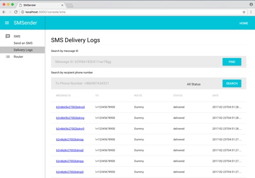

# SMSender

[](https://travis-ci.org/minchao/smsender)
[](https://goreportcard.com/report/github.com/minchao/smsender)

A SMS server written in Go (Golang).

* Support various SMS providers.
* Support routing, uses routes to determine which provider to send SMS.
* Support to receive delivery receipts from provider.
* SMS delivery worker.
* SMS delivery records.
* RESTful API.
* Admin Console UI.

## Requirements

* [Go](https://golang.org/)
* MySQL >= 5.7

## Installing

Getting the project:

```bash
go get github.com/minchao/smsender
```

Using the [Glide](https://glide.sh/) to install dependency packages:

```bash
glide install
```

Creating a Configuration file:
 
```bash
cp ./config/config.default.yml ./config.yml
```

Setup the MySQL DSN:

```yaml
db:
  dsn: "user:password@tcp(localhost:3306)/dbname?parseTime=true&loc=Local"
```

Registering providers on the sender server.

Add the provider key and secret to config.yml:

```yaml
providers:
  nexmo:
    key: "NEXMO_KEY"
    secret: "NEXMO_SECRET"
```

Add the following code to main.go:

```go
    sender := smsender.SMSender()
    
	nexmoProvider := nexmo.Config{
		Key:    config.GetString("providers.nexmo.key"),
		Secret: config.GetString("providers.nexmo.secret"),
	}.NewProvider("nexmo")
	
	sender.AddProvider(nexmoProvider)
	sender.Run()
```

Build:

```bash
go build -o bin/smsender
```

Run:

```bash
./bin/smsender
```

## Run in Docker

You can use the [docker-compose](https://docs.docker.com/compose/) to launch the preview version of SMSender, It will start the app and db in separate containers:

```bash
docker-compose up
```

## Providers

Support providers

* [AWS SNS (SMS)](https://aws.amazon.com/sns/)
* [Nexmo](https://www.nexmo.com/)
* [Twilio](https://www.twilio.com/)

Need another provider? Just implement the [Provider](https://github.com/minchao/smsender/blob/master/smsender/model/provider.go) interface.

## Routing

Route can be define a regexp phone number pattern to be matched with provider.

Example:

| Name    | Regular expression  | Provider | Description       |
|---------|---------------------|----------|-------------------|
| Dummy   | \\+12345678900      | dummy    | For testing       |
| User1   | \\+886987654321     | aws      | For specific user |
| Taiwan  | \\+886              | nexmo    |                   |
| USA     | \\+1                | twilio   |                   |
| Default | .*                  | nexmo    | Default           |

## RESTful API

The API document is written in YAML and found in the [smsender-openapi.yaml](https://github.com/minchao/smsender/blob/master/smsender-openapi.yaml).
You can use the [Swagger Editor](http://editor.swagger.io/) to open the document.

Example:

Send an SMS

```bash
curl -X POST http://localhost:8080/api/messages \
    -H "Content-Type: application/json" \
    -d '{"to": ["+886987654321"],"from": "Gopher","body": "Hello, 世界"}'
```

## Admin Console UI

The Console Web UI allows you to manage routes and monitor messages (at http://localhost:8080/console/).




## License

See the [LICENSE](LICENSE.md) file for license rights and limitations (MIT).
